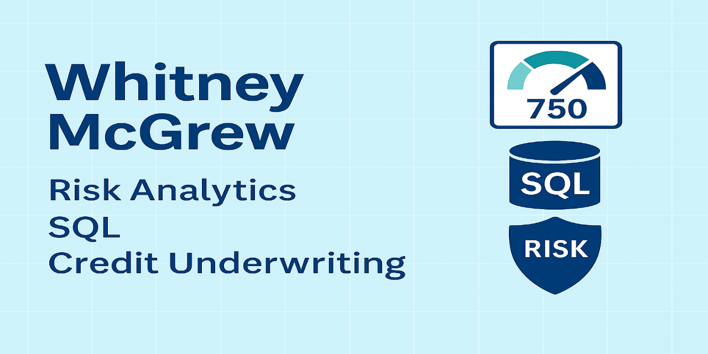

# 👋 Hi, I'm Whitney McGrew

### 💼 Senior Credit Analyst | 📊 Data Analytics Enthusiast | 🧠 SQL + Excel Power User

I'm a credit risk professional with experience in indirect auto lending, underwriting, and portfolio assessment. I specialize in analyzing creditworthiness using both traditional financial metrics and modern data tools like SQL, Excel, and data visualization. My passion is turning credit data into actionable insights that drive smarter lending decisions.

---

## 🔧 Tools & Skills
- **SQL** (SQLite, PostgreSQL)
- **Excel** (PivotTables, Conditional Formatting, Data Modeling)
- **Financial Analysis** (FICO, DTI, PTI, LTV, Derogatory History)
- **Git & GitHub** for version control and project documentation
- **Business Credit & Lending Knowledge**
- Currently pursuing: **CBCA Certification (CFI)**

---

## 📁 Featured Projects

### [SQL Credit Risk Analysis 🔗](https://github.com/wtmcgrew/sql-credit-risk-analysis)
> An end-to-end credit decisioning analysis using SQL and Excel. Includes mock application data, approval/decline trends by FICO, PTI, DTI, LTV, and late payments. Features well-structured queries, dynamic visuals, and business commentary.

---

## 📌 What I'm Working On
- Expanding into **commercial credit & energy underwriting**
- Building a **data-driven credit analysis portfolio**
- Publishing more **SQL + Excel + financial modeling** projects
- Launching a YouTube channel focused on **credit analytics and financial careers**

---

## 🤝 Let's Connect
- 📫 [LinkedIn](https://www.linkedin.com/in/whitneymcgrew)
- 💻 More projects coming soon!

---

> "Credit data is more than numbers — it’s risk, behavior, and opportunity waiting to be unlocked."

---

<!---
wtmcgrew/wtmcgrew is a ✨ special ✨ repository because its `README.md` (this file) appears on your GitHub profile.
You can click the Preview link to take a look at your changes.
--->
